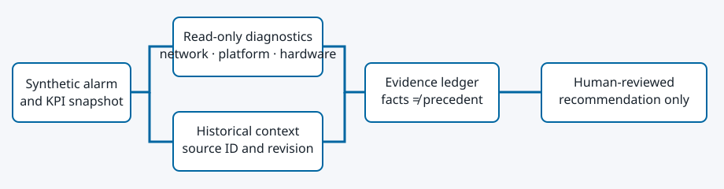

# Analyze Network Alarms with an Evidence-Backed Agent

Build a read-only telco incident investigator that separates current diagnostics from historical context and proposes a human-reviewed next step.

Network operations engineers often have to determine whether a timing alarm reflects a platform event or a hardware timestamp fault. This quickstart teaches a bounded investigation pattern with synthetic data, MCP diagnostic tools, source-aware retrieval, and an optional model-written explanation. India Mobile Congress is an audience profile, not a dependency; no Ericsson implementation or customer network data is included.

## Table of Contents

- [Overview](#overview)
- [Detailed description](#detailed-description)
- [Architecture](#architecture)
- [Requirements](#requirements)
- [Deploy](#deploy)
- [Repository structure](#repository-structure)
- [References](#references)
- [License](#license)
- [Tags](#tags)

## Overview

Run two incidents with different causes: one has a NIC timestamp fault; the other has a platform timing fault. The investigator calls three read-only MCP tools, records their timestamps and provenance, retrieves only approved synthetic runbook/case excerpts relevant to the observed signals, and returns a cited hypothesis, alternatives, unknowns, and a next diagnostic test. It never executes remediation. Missing or conflicting observations lead to abstention.

The core experience runs without an LLM so a participant can see which decisions came from evidence. An optional OpenAI-compatible client adds a clearly labeled, **unverified** explanation. The model cannot change the deterministic hypothesis or action boundary; drafts citing nonexistent or irrelevant evidence IDs are rejected. Structural citation checks do not establish that the prose is factually correct.

This repository contains four depths of one evidence-backed journey: a 5–7 minute presenter story, a 5–10 minute live demonstration, a 25–35 minute guided demo, and a 75–90 minute hands-on lab. The short story uses a question-driven architecture reveal and one proof, then deliberately hands the room to a deeper path. The lab adds a learner-built upstream-clock scenario, a fourth MCP diagnostic, controlled dependency failures, a reliability qualification report, and a NOC decision brief. Lab APIs are disabled unless `NETWORK_OPS_LAB_MODE=1`; the bounded demonstration remains the default runtime behavior.

The `presentation/` application tells the quickstart as a Red Hat × Intel interactive demo story. The built runtime serves it at `/story/`, and the full Showroom exposes it as the *Story* tab beside the live demonstration, guided demo, and hands-on lab. It preserves the same safety and evidence boundaries, calls `POST /api/investigate` for the two approved scenarios, explains the operating mechanisms inline, and builds its payoff from the causes, observation counts, request timing, and action boundary returned by the current Flightpath session. It never hard-codes infrastructure metrics. Run it with `npm run presentation:dev` and validate it with `npm run presentation:check`.

A persistent presenter environment, separate from Launchpad seat lifecycle, is deployed in Flightpath's `network-operations-demo` namespace. Reproducible immutable-image values and operational notes are under [`deploy/`](deploy/README.md).

## Detailed description

## Architecture



The diagnostic server and client use the MCP Python SDK over Streamable HTTP. The retrieval provider ranks approved excerpts from *observed* tool signals; fixture files no longer preselect the matching incident. The quickstart therefore illustrates MCP for present state and retrieval for historical context. Retrieval is tag-based, not vector search. See the [architecture and event flow](docs/architecture.md), [quickstart contract](contracts/quickstart-contract.yaml), and [HTTP API contract](contracts/openapi/openapi.yaml).

## Requirements

### Minimum hardware requirements

For the local synthetic stack: a workstation capable of running two small containers. No measured CPU, memory, latency, concurrency, or Intel hardware minimum is claimed. The OpenShift chart contains starter resource requests, not validated capacity guidance.

### Minimum software requirements

- Docker Compose, or Podman with a Compose provider, for the two-service path.
- Python 3.11 or newer for development/tests; install [development dependencies](requirements-dev.txt).
- Optional: Helm 3 and the `oc` CLI for the OpenShift path.
- Optional model: an assigned OpenAI-compatible `/v1` endpoint, model identifier, and runtime-injected API key.

### Required user permissions

Local container access is sufficient for the primary path. The optional OpenShift path needs permission to deploy namespaced workloads and services, apply a NetworkPolicy, pull an image, and port-forward the app. No cluster-scoped access or network-remediation permission is required.

## Deploy

### Prerequisites

Clone this repository. The default path uses only synthetic alarms and approved synthetic documents; do not supply real network data or credentials. The MCP server is unauthenticated and is never exposed as a public service by the provided Compose file or Helm chart.

### Installation — local quickstart

1. Start both services with `make compose-up`. For a Podman installation without a Compose provider, use `make compose-up COMPOSE='uvx podman-compose'` (or install `podman-compose` and set `COMPOSE=podman-compose`).
2. Open `http://127.0.0.1:8080`. Select **Timing alarm — hardware signal**, investigate, then repeat with **Timing alarm — platform signal**.
3. Compare the three current observations and their provenance with the separately labeled historical excerpts. The matching case changes, while the runbook remains general.
4. Use the **Human review simulation** to approve the recommendation for follow-up, request more evidence, or reject it. The response is not stored and executes nothing.
5. Run `make smoke`. It checks both causes, all three tool observations, retrieved source IDs, and the no-action boundary.

The Compose app binds to localhost. The diagnostics container is reachable only by the app on the internal network. To develop without containers, create a Python 3.11 environment, install `requirements-dev.txt`, run `make run-mcp PYTHON=.venv/bin/python` and then `NETWORK_OPS_MCP_URL=http://127.0.0.1:8095/mcp make run-local PYTHON=.venv/bin/python` in a second terminal.

### Installation — optional OpenShift path

Build and publish the [UBI-based image](Containerfile) to a registry accessible to your namespace; record its immutable digest. Render and review the [Helm chart](chart/Chart.yaml) before installing. The chart creates only two Deployments, two Services, and an ingress NetworkPolicy protecting MCP. Supply `image.repository` and `image.digest`; the defaults are local placeholders and cannot be pulled by a cluster. For example, once you have an approved image and existing namespace:

```sh
helm upgrade --install network-ops chart -n YOUR_NAMESPACE \
  --set image.repository=YOUR_REGISTRY/network-operations-agent \
  --set image.digest=sha256:YOUR_APPROVED_DIGEST
oc -n YOUR_NAMESPACE port-forward svc/network-ops-app 8080:8080
```

Open `http://127.0.0.1:8080` and run the same two investigations. No public Route is created by default. Launchpad can explicitly set `route.enabled=true` for its participant workspace. To enable optional model wording, have your environment owner provide an **existing Secret** with keys `endpoint`, `name`, and `api-key`, then set `model.existingSecret` on Helm install. The chart maps those keys to the application environment and never creates or prints the Secret.
If the registry image is private, create an image-pull Secret in the namespace through your approved credential process and set `image.pullSecret` to its name. Do not add registry credentials to this repository.

### Full lab path

The unified Showroom journey is sourced from `showroom-lab/` and built with `npm run build:lab`. Deploy it with `lab.enabled=true`; its entry page lets an instructor select Presentation, Demonstration, Guided demo, or Hands-on lab without ordering another environment. The deeper lab path adds only bounded synthetic authoring and failure-injection APIs. It still cannot execute remediation or accept arbitrary MCP tools. See the [lab contract](contracts/lab-contract.yaml).

### Optional model wording

The runtime variables are listed without values in [.env.example](.env.example). A model endpoint must use HTTPS, except for loopback HTTP during local development. The key is supplied by the endpoint owner or provisioner; this repository never assigns one. The model only drafts an explanation after a supported hypothesis exists. A missing, malformed, or unsupported model response leaves the evidence-based investigation intact. Review every model sentence against the cited IDs; no target-model quality claim has been made.

With an assigned endpoint, `make test-model PYTHON=.venv/bin/python` exercises both synthetic cases and prints drafts for review. Apply the [model-quality rubric](docs/model-quality-rubric.md); a passing structural check is not a factual-quality result.
The intended model for this quickstart is CPU-hosted. A direct route labeled `granite-3-2-8b-instruct-cpu` passed the two synthetic explanation checks; see the [limited CPU-targeted review](docs/model-validation-2026-09-22.md). Its backend placement still needs cluster-side confirmation. Do not substitute an accelerator-backed model for this quickstart.
An independent [Oberon CPU-only check](docs/oberon-cpu-validation-2026-09-22.md) passed with a temporary Granite 8B serving pod at a 16-CPU limit; the smaller Granite 2B model did not meet the evidence-quality gate. Oberon and RACMaaS are separate environments.

### Validating the deployment

Create a Python 3.11 virtual environment, install `requirements-dev.txt`, and run `make test-all PYTHON=.venv/bin/python`. `helm lint chart` checks chart syntax. `make smoke` exercises a running local or port-forwarded app; the two cases must produce different hypotheses. See [quickstart validation](docs/quickstart-validation.md) for the full proof and open release gates.

### Delete

Run `make compose-down` with the same `COMPOSE` setting used to start locally. For OpenShift, run `helm uninstall network-ops -n YOUR_NAMESPACE`; the pre-existing model Secret and namespace remain untouched. Stop any port-forward with Ctrl-C.

## Repository structure

- `src/network_ops/`: orchestration, MCP tools/client, retrieval, optional model client, web API, and smoke check.
- `data/`: synthetic alarm scenarios and approved historical excerpts.
- `web/`: learner-facing page.
- `tests/`: contract, behavior, MCP, model, retrieval, HTTP, chart, and publication checks.
- `chart/`: namespace-scoped OpenShift packaging with an opt-in participant Route and existing-Secret integration.
- `showroom/` and `site.yml`: the concise quickstart journey.
- `showroom-lab/` and `site-lab.yml`: the unified four-path Showroom and seven-module lab journey.
- `learner-templates/`: reusable quickstart pattern and complete lab scenario starters.
- `compose.yaml` and `Containerfile`: local two-service deployment on Red Hat UBI.
- `contracts/`: quickstart output and interface contract.
- `docs/`: architecture, validation, and Launchpad conversion notes.

## References

- [Quickstart validation and open gates](docs/quickstart-validation.md)
- [Architecture and event flow](docs/architecture.md)
- [Future quickstart-to-lab path](docs/future-lab-path.md)
- [Full lab contract](contracts/lab-contract.yaml)

This is a synthetic educational quickstart, not proof of reduced MTTR, fewer truck rolls, production readiness, or hardware acceleration. An amd64 test image was published to a private Quay repository and passed an isolated OpenShift smoke test. Optional CPU-labeled Granite 8B wording passed a [limited direct-model review](docs/model-validation-2026-09-22.md) on two synthetic incidents; backend CPU placement, tenant-gateway access, broader model quality, and contributor-organization review remain open.

## License

This project is licensed under the [MIT License](LICENSE).

## Tags

- **Title:** Analyze Network Alarms with an Evidence-Backed Agent
- **Description:** Synthetic telco incident investigation with current MCP diagnostics, retrieved context, and human review
- **Industry:** Telecommunications
- **Product:** Red Hat OpenShift; Intel hardware as an optional reference integration
- **Use case:** Network operations incident investigation
- **Partner:** Intel (reference integration, not required by synthetic mode)
- **Contributor org:** Draft; ownership to be confirmed before public release
